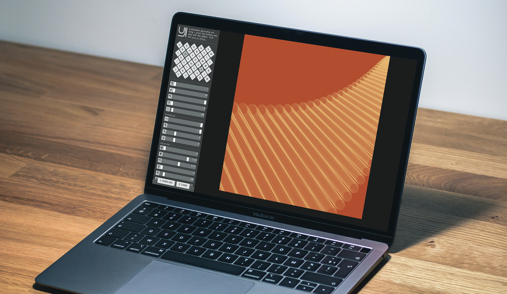

* A minimalist generative art thing – press the buttons and play with the sliders!*

The interface is designed (or, rather, deliberately *not designed*) for **exploration through play** – both for you, as the user, and me, as the person who made the weird-ass interface. It's intended to facilitate a vaguely meditative and creative environment.

The **tiled buttons at the top are presets** – use them as jumping-off points, or click your way through them to see what's possible before starting afresh by yourself. The <kbd>⌘</kbd> preset has all options set to their defaults, so it's a good starting point once you've played around a bit.

The **sliders determine all aspects of the generated images**. Hover over the icons next to them (which feature glyphs from [Imperial Aramaic](https://en.wikipedia.org/wiki/Imperial_Aramaic#Unicode) and [Phoenician](https://en.wikipedia.org/wiki/Phoenician_alphabet#Unicode)) for descriptions of what each slider does. You can also edit the options directly through the text inputs next to the sliders, which you're able to conveniently <kbd>tab</kbd> through. And pressing <kbd>+</kbd>, <kbd>→</kbd>, or <kbd>↑</kbd> while your mouse pointer's hovering over a slider will increase its value (<kbd>-</kbd>, <kbd>←</kbd>, or <kbd>↓</kbd> will *de*crease it instead). Press <kbd>shift</kbd> at the same time to adjust in 10× larger increments.

#### [🎨 Play around with the various options at `doersino.github.io/uji/`!](https://doersino.github.io/uji/)

If you find that changing a slider slightly modifies some behavior you'd expect to be the domain of other sliders: Let's just say that's a constraint designed to send your creativity down fresh paths (and not a result of lazy implementation details).

At the bottom of the sidebar, there's a couple of buttons: Firstly, the conjoined buttons sporting chevron icons provide **undo/redo** functionality (the usual keyboard shortcuts work as well). Upon clicking the **self-explantory "Export" button**, you'll be presented with a choice of available formats: PNG, JPEG, SVG, and JSON, the latter two of which are [intended for pen plotting](https://github.com/doersino/uji/issues/3). The adjacent **"Share" button reveals a shareable URL that encodes your options**, which comes in real handy if you want to show a thing you've made with UJI to someone else. (If you press <kbd>alt</kbd> while clicking either button, the default action is performed in each case – PNG download *slash* URL-to-clipboard-copying.)

*About the name:* I could pretend that it's referring to the concept of [*uji* in Zen Buddhism](https://en.wikipedia.org/wiki/Uji_(Being-Time)), but really, the letters just lend themselves to a pretty logo, an [initial iteration](https://github.com/doersino/brachiosaurus/blob/24fb60c86e037053ed1003a356a7ca1d8135c5fd/examples.py#L413) of which I had previously cobbled together with my pen plotting tool [Brachiosaurus](https://github.com/doersino/brachiosaurus/) and later [made](https://twitter.com/doersino/status/1396194883304660997) the [final logo](https://gist.github.com/doersino/c2c4e3f110b75ac8eef3b46a8ee30d36) (along with the *undo*, *redo*, *export*, and *share* icons) using the [Markdeep Diagram Drafting Board](https://github.com/doersino/markdeep-diagram-drafting-board).

## Notes

### Setup

It's just some HTML, JavaScript, an image, and a few webfonts – so no setup is required! If you want to run this tool locally, simply `git clone` this repository or [download a ZIP](https://github.com/doersino/uji/archive/refs/heads/main.zip), then open `index.html` in your favorite browser. Of course, link sharing doesn't make a whole lot of sense in that context, but the rest should work just fine.

### Features I wanted to add but didn't because I would've gotten bored of it and never released this thing in the first place

Perhaps I'll knock some of those down at some point if motivation strikes. (Update: Done quite a few, but there's always more!) In the meantime, feel free to [file an issue](http://github.com/doersino/uji/issues) if you really want one of them to be implemented (or do it yourself and send a pull request!).

* Some way of randomizing options without constantly generating junk, see [here](https://github.com/doersino/uji/issues/1).
* WebGL rendering for performance – although blend modes and blurring might not be so easy there, and the current `<canvas>`-based approach would still be needed as a fallback.
* Exporting the generation process as a video, see [here](https://stackoverflow.com/questions/19235286/convert-html5-canvas-sequence-to-a-video-file/62065826#62065826) – this might be worth revisiting later since it's only been made possible at all somewhat recently. [In a similar vein, "meta sliders" that enable the generation of [short animations like this one](https://www.reddit.com/r/generative/comments/nozv1a/one_way_portal_made_with_uji/). But that seems too complex from a user-interface perspective (and *prohibitively* slow to render all the frames for even just a preview), so this is really just a pipe dream.]
* Due to an oversight early on, for circle/square/triangle-shaped lines, the line terminates a bit short of its origin – the lower the segment count, the more apparent this is. That's not a difficult fix, but it would subtly change the appearance of previously-created-and-then-accessed-through-share-URLs drawings – for some of which the present behavior may constitute a point of important visual interest – so, if this was to be addressed, some sort of drawing algorithm versioning scheme appended to share URLs and downloaded filenames would be required.

### Known bugs

Chrome tends to draw less distinct/clear/bright lines than other browsers.

## License

You may use this repository's contents under the terms of the bespoke *It's the MIT License Except You're Not Allowed to Make an NFT Unless You Use the Proceeds to Feed Birds & Send Me Pictures of Them* license, see `LICENSE`.

However, the subdirectory `fonts/` contains **third-party webfonts with their own licenses**:

* Renzhi Li's **Iosevka Aile**, the typeface used throughout the interface, is licensed under the *SIL Open Font License Version 1.1*, see [here](https://github.com/be5invis/Iosevka/blob/master/LICENSE.md).
* Google's **Noto Sans**, which provides the glyphs of the ancient scripts used for presets and slider labels, is also used in accordance with its *SIL Open Font License Version 1.1*, see [here](https://github.com/googlefonts/noto-fonts/blob/main/LICENSE).

Further, the **stock photo** of the laptop was taken by [Howard Bouchevereau](https://unsplash.com/photos/RSCirJ70NDM), the one showing the chair and the picture frames was captured by [Christopher Burns](https://unsplash.com/photos/BdVQU-NDtA8), and both have been sourced from [Unsplash](https://unsplash.com/).

Finally – this isn't relevant of licensing but I'd like to mention it – the **general layout has been adapted from [Markdeep Diagram Drafting Board](https://github.com/doersino/markdeep-diagram-drafting-board) and [Crop Circles](https://github.com/doersino/cropcircles)**, both are previous projects of mine.
